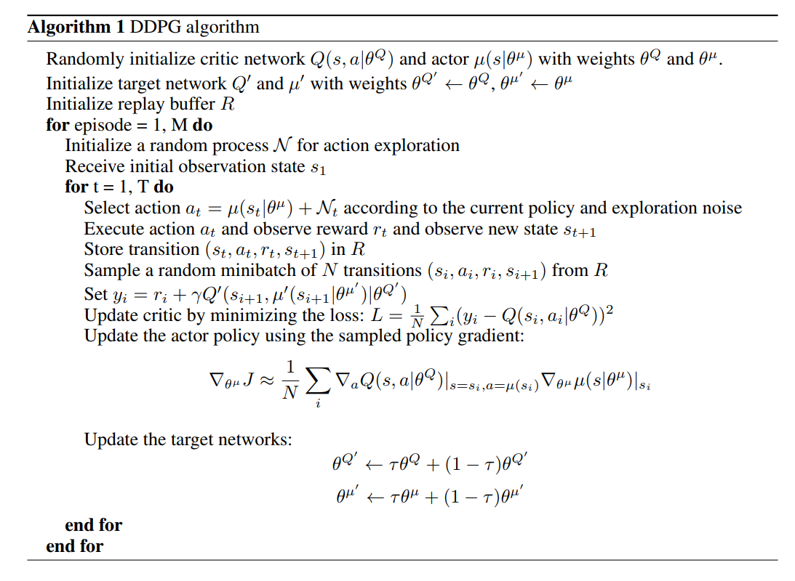
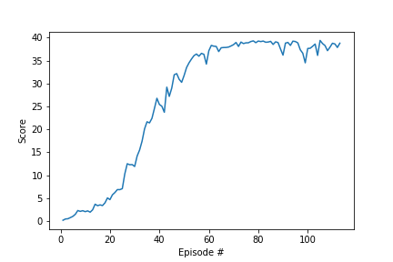

## Task 2: Continuous Control  

### Introduction  
This is the report for the task of continuous controll. The project demonstrates how policy-based methods can be used to learn the optimal policy in a model-free Reinforcement Learning setting using a Unity environment, in which a double-jointed arm can move to target locations.  

### Algorithm  
The DDPG algorithm was implemented to train the agents. Deep Deterministic Policy Gradient (DDPG) is an algorithm which concurrently learns a Q-function and a policy. It uses off-policy data and the Bellman equation to learn the Q-function, and uses the Q-function to learn the policy.  
Here’s the pseudo-code of the algorithm:
  

### Architecture   
| Actor   |  Critic |
| :------- |   :------- |
| BatchNorm1d (33)|  BatchNorm1d (33) |
| Linear (33, 400)|   Linear (33, 400) |
|RELU|  RELU|  
| Linear (400, 300)|Linear (404, 300)|
|RELU|  RELU| 
| Linear (300, 4)|Linear (300, 1)|
|tanh|   

### Parameters  
| | |
| :------- |   :------- |
| BUFFER_SIZE| 1e6 |
| BATCH_SIZE|   64|
| GAMMA|  0.99|  
| TAU|1e-3|
| LR_ACTOR|  1e-4| 
| LR_CRITIC|3e-4|
| WEIGHT_DECAY| 0| 
| epsilon_min|  0.01|
| epsilon_decay | 0.95 |
|n_episodes | 1000|
|max_t | 1000|

### Results  
Environment solved in 113 episodes!	Average Score: 30.07  

 

### Ideas for Future Work
 - Try other algorithms such as Trust Region Policy Optimization (TRPO), Truncated Natural Policy Gradient (TNPG) and Proximal Policy Optimization (PPO), which have also demonstrated good performance with continuous control tasks.
- Try to explore the (very!) recent Distributed Distributional Deterministic Policy Gradients (D4PG) algorithm as another method for adapting DDPG for continuous control.  
- Implement DDPG with HER (Hindsight Experience Replay)  

#### Reference  
1. https://spinningup.openai.com/en/latest/algorithms/ddpg.html#documentation